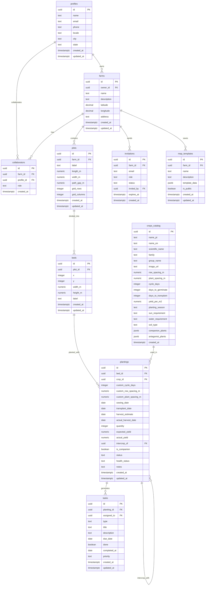
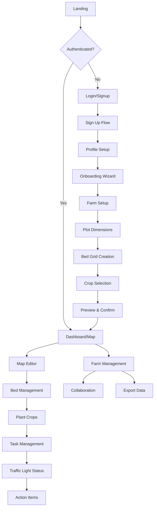
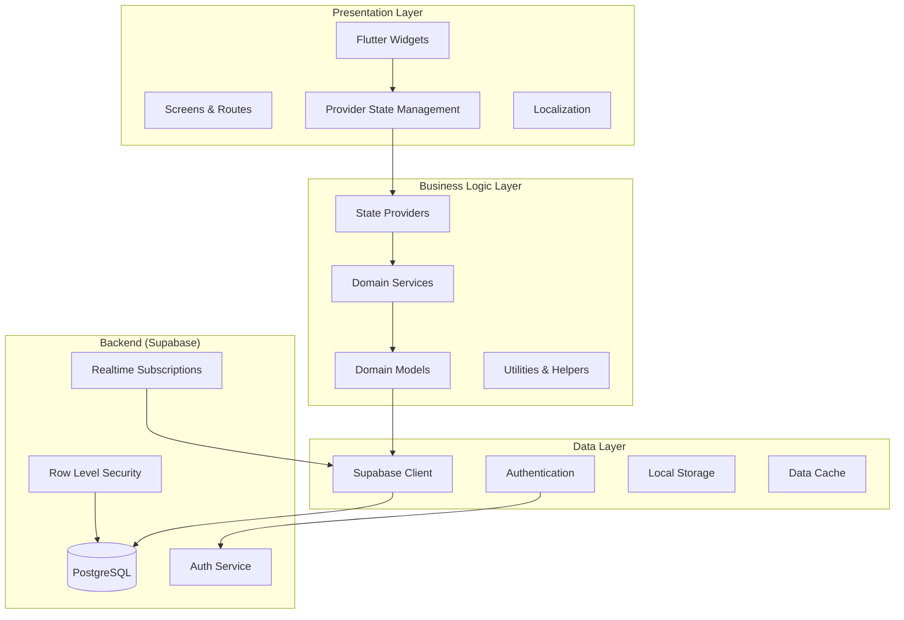

<h1 align="center">
  <br>
  
  <br>
  Seedfy 🌱
  <br>
</h1>

<p align="center">
  <strong>A comprehensive farm management application for small producers and urban gardening enthusiasts</strong>
</p>

<p align="center">
  
  
  
  
  <a href="https://github.com/gabrielmaialva33/seedfy_app/commits/master">
    
      
  </a>
</p>

<br>

<p align="center">
  <a href="#bookmark-about">About</a>&nbsp;&nbsp;&nbsp;|&nbsp;&nbsp;&nbsp;
  <a href="#computer-technologies">Technologies</a>&nbsp;&nbsp;&nbsp;|&nbsp;&nbsp;&nbsp;
  <a href="#wrench-tools">Tools</a>&nbsp;&nbsp;&nbsp;|&nbsp;&nbsp;&nbsp;
  <a href="#package-installation">Installation</a>&nbsp;&nbsp;&nbsp;|&nbsp;&nbsp;&nbsp;
  <a href="#gear-usage">Usage</a>&nbsp;&nbsp;&nbsp;|&nbsp;&nbsp;&nbsp;
  <a href="#memo-license">License</a>
</p>

<br>

## :bookmark: About

**Seedfy** is a comprehensive farm management application designed specifically for small producers and urban gardening enthusiasts. It provides an intuitive interface for planning, managing, and tracking agricultural activities with guided workflows and intelligent task automation.

## 🎯 Project Vision

Enable users to define their cultivation areas, choose crops, visualize interactive farm maps with
planting estimates and harvest timelines, and interact with a beautiful, simple interface featuring
traffic light status indicators for harvest proximity. The system generates basic tasks (
watering/fertilizing/transplanting/harvesting) with editing and rescheduling capabilities, plus CSV
export functionality.

<br>

## :computer: Technologies

- **[Flutter](https://flutter.dev/)** 3.x + Dart
- **[Supabase](https://supabase.com/)** (Auth, PostgreSQL, Storage, RLS)
- **[Provider](https://pub.dev/packages/provider)** for State Management
- **[PostgreSQL](https://www.postgresql.org/)** with Row Level Security
- **[Flutter Localizations](https://docs.flutter.dev/development/accessibility-and-localization/internationalization)** (pt-BR, en-US)

<br>

## :wrench: Tools

- **[Visual Studio Code](https://code.visualstudio.com/)**
- **[Android Studio](https://developer.android.com/studio)**
- **[Supabase Dashboard](https://app.supabase.com/)**
- **[Flutter Inspector](https://docs.flutter.dev/development/tools/flutter-inspector)**
- **[Dart Analysis](https://dart.dev/tools/analysis)**

<br>

## :package: Installation

### :heavy_check_mark: **Prerequisites**

The following software must be installed:

- **[Flutter](https://flutter.dev/docs/get-started/install)** (>=3.0.0)
- **[Dart](https://dart.dev/get-dart)** (>=3.0.0)
- **[Git](https://git-scm.com/)**
- **[Android Studio](https://developer.android.com/studio)** or **[VS Code](https://code.visualstudio.com/)**
- **[Supabase Account](https://supabase.com/)** and project

<br>

### :arrow_down: **Cloning the repository**

```sh
$ git clone https://github.com/gabrielmaialva33/seedfy_app.git
$ cd seedfy_app
```

<br>

### :arrow_forward: **Running the application**

### Key Features

✅ **User Authentication & Profiles**

- Registration with email, phone, location
- Profile management with language preferences
- Password recovery

✅ **Guided Onboarding Wizard**

- Farm area dimensions setup
- Bed corridor configuration
- Crop selection with visual gallery
- Interactive preview with planting estimates
- Editable approval workflow

✅ **Interactive Map Editor**

- Abstract grid-based bed layout
- Pan/zoom functionality
- Resizable rectangular beds
- Crop assignment per bed
- Intercropping support
- Timeline visualization

✅ **Smart Task Management**

- Auto-generated tasks based on crop cycles
- Manual task creation and editing
- Due date tracking and rescheduling
- Task completion workflow

✅ **Traffic Light Status System**

- 🟢 Green: >50% of cycle remaining
- 🟡 Yellow: 20-50% remaining
- 🔴 Red: <20% or overdue
- Visual status indicators per bed

✅ **Collaboration & Sharing**

- Farm owner/editor permissions
- Read-only viewer access via shared links
- Multi-user collaboration

✅ **Data Export**

- CSV export of plantings and tasks
- Historical data tracking
- Report generation

## 📊 Database Schema

### Entity Relationship Diagram



### Table Descriptions

#### Core Tables

- **profiles**: User profiles extending Supabase authentication with personal information and
  preferences
- **farms**: Farm or garden entities owned by users with location and descriptive data
- **collaborators**: Many-to-many relationship for farm access control (owner, editor, viewer roles)
- **invitations**: Pending collaboration invitations with expiration and status tracking

#### Spatial Organization

- **plots**: Physical cultivation areas within farms with dimensions and grid layout
- **beds**: Individual planting beds within plots with exact positioning and dimensions
- **map_templates**: Reusable bed layout templates for quick farm setup

#### Agricultural Data

- **crops_catalog**: Comprehensive crop database with cultivation parameters, spacing requirements,
  and companion planting information
- **plantings**: Active crop instances in beds with customizable parameters and intercropping
  support
- **tasks**: Agricultural tasks linked to plantings with assignment and priority management

### Database Features

- **Row Level Security (RLS)**: All tables protected with appropriate access policies
- **Automatic Timestamps**: Updated via triggers for audit trails
- **Referential Integrity**: Foreign key constraints ensure data consistency
- **Check Constraints**: Business rule validation at database level
- **Indexes**: Optimized for common query patterns
- **JSONB Fields**: Flexible storage for companion plants and template data

## 🔄 User Flow



## 🏛️ Application Architecture



## 🗂️ Project Structure

### Frontend Structure (lib/)

```
lib/
├── core/                       # Core functionality & utilities
│   ├── di/                   # Dependency injection
│   ├── errors/               # Error handling
│   ├── network/              # Network configuration
│   ├── providers/            # Core providers
│   ├── theme/                # App theming
│   └── widgets/              # Reusable widgets
├── features/                   # Feature modules (Clean Architecture)
│   ├── ai_camera/            # AI-powered camera features
│   │   └── screens/
│   ├── ai_chat/              # AI chat assistant
│   │   └── screens/
│   ├── analytics/            # Analytics dashboard
│   │   └── screens/
│   ├── auth/                 # Authentication module
│   │   ├── data/            # Data layer (repositories, datasources)
│   │   ├── domain/          # Domain layer (entities, usecases)
│   │   └── presentation/    # Presentation layer (screens, widgets, blocs)
│   ├── collaboration/        # Farm collaboration features
│   │   ├── data/
│   │   ├── domain/
│   │   └── presentation/
│   ├── farm/                 # Farm management
│   │   ├── data/
│   │   ├── domain/
│   │   └── presentation/
│   ├── home/                 # Home dashboard
│   │   └── screens/
│   ├── map/                  # Interactive map editor
│   │   ├── screens/
│   │   └── widgets/
│   ├── onboarding/           # Guided setup wizard
│   │   └── screens/
│   ├── profile/              # User profile management
│   │   └── screens/
│   ├── settings/             # App settings
│   │   └── screens/
│   ├── shared/               # Shared feature components
│   │   └── widgets/
│   └── tasks/                # Task management
│       └── screens/
├── l10n/                       # Internationalization files
├── shared/                     # Shared business logic
│   ├── data/
│   │   ├── datasources/
│   │   └── dto/
│   ├── domain/
│   │   ├── entities/
│   │   └── repositories/
│   └── presentation/
│       └── widgets/
└── main.dart                   # Application entry point
```

### Backend Structure (supabase/)

```
supabase/
├── migrations/                 # Database migrations (executed in order)
│   ├── 00001_enable_extensions.sql          # PostgreSQL extensions
│   ├── 00002_create_profiles_table.sql      # User profiles
│   ├── 00003_create_farms_table.sql         # Farms/gardens
│   ├── 00004_create_plots_table.sql         # Cultivation areas
│   ├── 00005_create_beds_table.sql          # Individual beds
│   ├── 00006_create_crops_catalog_table.sql # Crop varieties
│   ├── 00007_create_plantings_table.sql     # Planted crops
│   ├── 00008_create_tasks_table.sql         # Cultivation tasks
│   ├── 00009_create_collaborators_table.sql # Farm collaborations
│   ├── 00010_create_invitations_table.sql   # Collaboration invites
│   ├── 00011_create_map_templates_table.sql # Reusable templates
│   ├── 00012_create_functions.sql           # Database functions
│   ├── 00013_create_triggers.sql            # Automatic triggers
│   ├── 00014_insert_seed_data.sql           # Initial crop data
│   ├── 00015_grant_permissions.sql          # Access permissions
│   └── 00016_update_collaboration_policies.sql # RLS policies
├── functions/                  # Edge functions (if any)
└── seed.sql                   # Database seeding script
```

## 🌍 Internationalization

The app supports two languages with complete localization:

- **Portuguese (pt-BR)**: Primary language for Brazilian users
- **English (en-US)**: Secondary language for international users

Users can switch languages in their profile settings, with preferences stored in Supabase.

```sh
# Install dependencies
$ flutter pub get

# Configure Supabase
# Update lib/core/app_config.dart with your Supabase URL and anon key
# Or use environment variables for production

# Set up database
$ cd supabase/migrations
# Execute each file in numerical order (00001 to 00016) in your Supabase SQL editor

# Run the application
$ flutter run -d chrome  # For web development
$ flutter run            # For mobile device/emulator

# Build for production
$ flutter build web --release
$ flutter build apk --release
$ flutter build ios --release
```

<br>

## :gear: Usage

## 🔧 Configuration

### Database Migrations

The project uses a professional migration structure located in `supabase/migrations/`:

```
supabase/migrations/
├── 00001_enable_extensions.sql          # PostgreSQL extensions
├── 00002_create_profiles_table.sql      # User profiles
├── 00003_create_farms_table.sql         # Farms/gardens
├── 00004_create_plots_table.sql         # Cultivation areas
├── 00005_create_beds_table.sql          # Individual beds
├── 00006_create_crops_catalog_table.sql # Crop varieties
├── 00007_create_plantings_table.sql     # Planted crops
├── 00008_create_tasks_table.sql         # Cultivation tasks
├── 00009_create_collaborators_table.sql # Farm collaborations
├── 00010_create_invitations_table.sql   # Collaboration invites
├── 00011_create_map_templates_table.sql # Reusable templates
├── 00012_create_functions.sql           # Database functions
├── 00013_create_triggers.sql            # Automatic triggers
├── 00014_insert_seed_data.sql           # Initial crop data
├── 00015_grant_permissions.sql          # Access permissions
└── 00016_update_collaboration_policies.sql # RLS policies
```

Each migration file is:

- **Self-contained**: Can be run independently
- **Idempotent**: Safe to run multiple times (uses IF NOT EXISTS)
- **Well-documented**: Contains comments explaining purpose
- **Ordered**: Must be executed in numerical sequence

### Supabase Setup

1. Create a new Supabase project
2. Navigate to SQL Editor in the Supabase dashboard
3. Execute each migration file in order (00001 to 00016)
4. Configure authentication settings
5. Add your project URL and API key to the app configuration

### Environment Variables

Create a `.env` file in the project root:

```env
SUPABASE_URL=your_supabase_url
SUPABASE_ANON_KEY=your_supabase_anon_key
```

## 📱 Deployment

### Web Deployment

```bash
flutter build web --release
# Deploy to your web hosting service
```

### Mobile Deployment

```bash
# Android
flutter build apk --release
flutter build appbundle --release

# iOS  
flutter build ios --release
```

## 🔐 Security

- **Row Level Security (RLS)** enabled on all Supabase tables
- **Authentication** required for all operations
- **Role-based access control** for farm collaboration
- **Data validation** on client and server side
- **Secure API** communication with Supabase

## 🧪 Testing

```bash
# Run unit tests
flutter test

# Run integration tests
flutter test integration_test/

# Run widget tests
flutter test test/widget_test.dart
```

## :sparkles: Features

### Core Features

- **User Authentication & Profiles**: Registration, profile management, password recovery
- **Guided Onboarding Wizard**: Farm setup, bed configuration, crop selection
- **Interactive Map Editor**: Grid-based bed layout with pan/zoom functionality
- **Smart Task Management**: Auto-generated and manual tasks with scheduling
- **Traffic Light Status System**: Visual indicators for harvest proximity
- **Collaboration & Sharing**: Multi-user farm access with role-based permissions
- **Data Export**: CSV export and historical tracking
- **Internationalization**: Support for pt-BR and en-US languages

### Advanced Features

- **Real-time Collaboration**: Live updates across multiple users
- **Intercropping Support**: Companion planting management
- **Task Automation**: Intelligent task generation based on crop cycles
- **Interactive Timeline**: Visual representation of planting and harvest schedules
- **Mobile Optimization**: Responsive design for mobile and tablet devices

<br>

## 📋 Roadmap

### Phase 1: MVP Core Features ✅

- [x] User authentication and profiles
- [x] Basic farm and plot management
- [x] Crop catalog and planting system
- [x] Simple task management
- [x] Internationalization support

### Phase 2: Advanced Features 🚧

- [ ] Interactive map editor with drag-drop
- [ ] Advanced task automation
- [ ] Real-time collaboration
- [ ] Mobile app optimization
- [ ] Offline functionality

### Phase 3: Analytics & Growth 📋

- [ ] Advanced analytics dashboard
- [ ] Crop yield predictions
- [ ] Weather integration
- [ ] Community features
- [ ] Marketplace integration

### :writing_hand: **Author**

| [](https://github.com/gabrielmaialva33) |
| ----------------------------------------------------------------------------------------------------------------- |
| [Gabriel Maia](https://github.com/gabrielmaialva33)                                                               |

## License

[MIT License](LICENSE)

<p align="center"></p>
<p align="center">&copy; 2017-present <a href="https://github.com/gabrielmaialva33/" target="_blank">Maia</a>
</p>