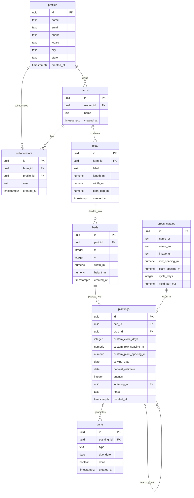
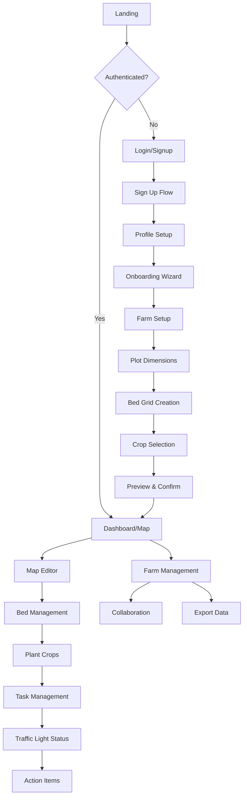
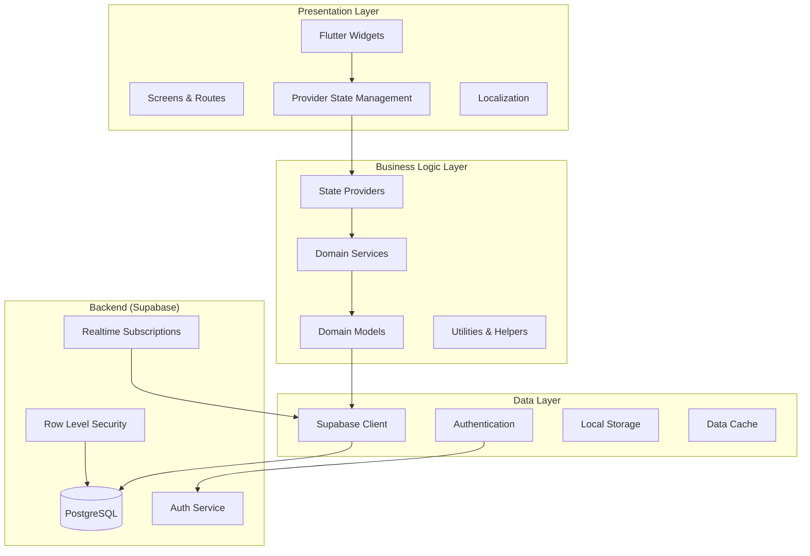

# Seedfy 🌱

**Farm management app for small producers and urban gardens**

Seedfy is a comprehensive farm management application designed specifically for small producers and
urban gardening enthusiasts. It provides an intuitive interface for planning, managing, and tracking
agricultural activities with guided workflows and intelligent task automation.

## 🎯 Project Vision

Enable users to define their cultivation areas, choose crops, visualize interactive farm maps with
planting estimates and harvest timelines, and interact with a beautiful, simple interface featuring
traffic light status indicators for harvest proximity. The system generates basic tasks (
watering/fertilizing/transplanting/harvesting) with editing and rescheduling capabilities, plus CSV
export functionality.

## 🏗️ Architecture Overview

### Technology Stack

- **Frontend**: Flutter 3.x + Dart
- **Backend**: Supabase (Auth, PostgreSQL, Storage, RLS)
- **State Management**: Provider pattern
- **Internationalization**: flutter_localizations (pt-BR, en-US)
- **Database**: PostgreSQL with Row Level Security
- **Authentication**: Supabase Auth
- **Deployment**: Flutter Web + Mobile apps

### Key Features

✅ **User Authentication & Profiles**

- Registration with email, phone, location
- Profile management with language preferences
- Password recovery

✅ **Guided Onboarding Wizard**

- Farm area dimensions setup
- Bed corridor configuration
- Crop selection with visual gallery
- Interactive preview with planting estimates
- Editable approval workflow

✅ **Interactive Map Editor**

- Abstract grid-based bed layout
- Pan/zoom functionality
- Resizable rectangular beds
- Crop assignment per bed
- Intercropping support
- Timeline visualization

✅ **Smart Task Management**

- Auto-generated tasks based on crop cycles
- Manual task creation and editing
- Due date tracking and rescheduling
- Task completion workflow

✅ **Traffic Light Status System**

- 🟢 Green: >50% of cycle remaining
- 🟡 Yellow: 20-50% remaining
- 🔴 Red: <20% or overdue
- Visual status indicators per bed

✅ **Collaboration & Sharing**

- Farm owner/editor permissions
- Read-only viewer access via shared links
- Multi-user collaboration

✅ **Data Export**

- CSV export of plantings and tasks
- Historical data tracking
- Report generation

## 📊 Database Schema



## 🔄 User Flow



## 🏛️ Application Architecture



## 🗂️ Project Structure

### Frontend Structure (lib/)

```
lib/
├── core/                       # Core functionality & utilities
│   ├── di/                   # Dependency injection
│   ├── errors/               # Error handling
│   ├── network/              # Network configuration
│   ├── providers/            # Core providers
│   ├── theme/                # App theming
│   └── widgets/              # Reusable widgets
├── features/                   # Feature modules (Clean Architecture)
│   ├── ai_camera/            # AI-powered camera features
│   │   └── screens/
│   ├── ai_chat/              # AI chat assistant
│   │   └── screens/
│   ├── analytics/            # Analytics dashboard
│   │   └── screens/
│   ├── auth/                 # Authentication module
│   │   ├── data/            # Data layer (repositories, datasources)
│   │   ├── domain/          # Domain layer (entities, usecases)
│   │   └── presentation/    # Presentation layer (screens, widgets, blocs)
│   ├── collaboration/        # Farm collaboration features
│   │   ├── data/
│   │   ├── domain/
│   │   └── presentation/
│   ├── farm/                 # Farm management
│   │   ├── data/
│   │   ├── domain/
│   │   └── presentation/
│   ├── home/                 # Home dashboard
│   │   └── screens/
│   ├── map/                  # Interactive map editor
│   │   ├── screens/
│   │   └── widgets/
│   ├── onboarding/           # Guided setup wizard
│   │   └── screens/
│   ├── profile/              # User profile management
│   │   └── screens/
│   ├── settings/             # App settings
│   │   └── screens/
│   ├── shared/               # Shared feature components
│   │   └── widgets/
│   └── tasks/                # Task management
│       └── screens/
├── l10n/                       # Internationalization files
├── shared/                     # Shared business logic
│   ├── data/
│   │   ├── datasources/
│   │   └── dto/
│   ├── domain/
│   │   ├── entities/
│   │   └── repositories/
│   └── presentation/
│       └── widgets/
└── main.dart                   # Application entry point
```

### Backend Structure (supabase/)

```
supabase/
├── migrations/                 # Database migrations (executed in order)
│   ├── 00001_enable_extensions.sql          # PostgreSQL extensions
│   ├── 00002_create_profiles_table.sql      # User profiles
│   ├── 00003_create_farms_table.sql         # Farms/gardens
│   ├── 00004_create_plots_table.sql         # Cultivation areas
│   ├── 00005_create_beds_table.sql          # Individual beds
│   ├── 00006_create_crops_catalog_table.sql # Crop varieties
│   ├── 00007_create_plantings_table.sql     # Planted crops
│   ├── 00008_create_tasks_table.sql         # Cultivation tasks
│   ├── 00009_create_collaborators_table.sql # Farm collaborations
│   ├── 00010_create_invitations_table.sql   # Collaboration invites
│   ├── 00011_create_map_templates_table.sql # Reusable templates
│   ├── 00012_create_functions.sql           # Database functions
│   ├── 00013_create_triggers.sql            # Automatic triggers
│   ├── 00014_insert_seed_data.sql           # Initial crop data
│   ├── 00015_grant_permissions.sql          # Access permissions
│   └── 00016_update_collaboration_policies.sql # RLS policies
├── functions/                  # Edge functions (if any)
└── seed.sql                   # Database seeding script
```

## 🌍 Internationalization

The app supports two languages with complete localization:

- **Portuguese (pt-BR)**: Primary language for Brazilian users
- **English (en-US)**: Secondary language for international users

Users can switch languages in their profile settings, with preferences stored in Supabase.

## 🚀 Getting Started

### Prerequisites

- Flutter 3.x+
- Dart 3.x+
- Supabase account and project
- Android Studio / VS Code

### Installation

1. **Clone the repository**
   ```bash
   git clone <repository-url>
   cd seedfy_app
   ```

2. **Install dependencies**
   ```bash
   flutter pub get
   ```

3. **Configure Supabase**
   - Update `lib/core/app_config.dart` with your Supabase URL and anon key
   - Or use environment variables for production

4. **Set up database**
   ```bash
   # Run all migrations in order in your Supabase SQL editor
   cd supabase/migrations
   # Execute each file in numerical order (00001 to 00016)
   ```

5. **Run the app**
   ```bash
   flutter run -d chrome  # For web
   flutter run            # For mobile
   ```

## 🔧 Configuration

### Database Migrations

The project uses a professional migration structure located in `supabase/migrations/`:

```
supabase/migrations/
├── 00001_enable_extensions.sql          # PostgreSQL extensions
├── 00002_create_profiles_table.sql      # User profiles
├── 00003_create_farms_table.sql         # Farms/gardens
├── 00004_create_plots_table.sql         # Cultivation areas
├── 00005_create_beds_table.sql          # Individual beds
├── 00006_create_crops_catalog_table.sql # Crop varieties
├── 00007_create_plantings_table.sql     # Planted crops
├── 00008_create_tasks_table.sql         # Cultivation tasks
├── 00009_create_collaborators_table.sql # Farm collaborations
├── 00010_create_invitations_table.sql   # Collaboration invites
├── 00011_create_map_templates_table.sql # Reusable templates
├── 00012_create_functions.sql           # Database functions
├── 00013_create_triggers.sql            # Automatic triggers
├── 00014_insert_seed_data.sql           # Initial crop data
├── 00015_grant_permissions.sql          # Access permissions
└── 00016_update_collaboration_policies.sql # RLS policies
```

Each migration file is:
- **Self-contained**: Can be run independently
- **Idempotent**: Safe to run multiple times (uses IF NOT EXISTS)
- **Well-documented**: Contains comments explaining purpose
- **Ordered**: Must be executed in numerical sequence

### Supabase Setup

1. Create a new Supabase project
2. Navigate to SQL Editor in the Supabase dashboard
3. Execute each migration file in order (00001 to 00016)
4. Configure authentication settings
5. Add your project URL and API key to the app configuration

### Environment Variables

Create a `.env` file in the project root:

```env
SUPABASE_URL=your_supabase_url
SUPABASE_ANON_KEY=your_supabase_anon_key
```

## 📱 Deployment

### Web Deployment

```bash
flutter build web --release
# Deploy to your web hosting service
```

### Mobile Deployment

```bash
# Android
flutter build apk --release
flutter build appbundle --release

# iOS  
flutter build ios --release
```

## 🔐 Security

- **Row Level Security (RLS)** enabled on all Supabase tables
- **Authentication** required for all operations
- **Role-based access control** for farm collaboration
- **Data validation** on client and server side
- **Secure API** communication with Supabase

## 🧪 Testing

```bash
# Run unit tests
flutter test

# Run integration tests
flutter test integration_test/

# Run widget tests
flutter test test/widget_test.dart
```

## 🤝 Contributing

1. Fork the repository
2. Create a feature branch (`git checkout -b feature/amazing-feature`)
3. Commit your changes (`git commit -m 'Add some amazing feature'`)
4. Push to the branch (`git push origin feature/amazing-feature`)
5. Open a Pull Request

## 📋 Roadmap

### Phase 1: MVP Core Features ✅

- [x] User authentication and profiles
- [x] Basic farm and plot management
- [x] Crop catalog and planting system
- [x] Simple task management
- [x] Internationalization support

### Phase 2: Advanced Features 🚧

- [ ] Interactive map editor with drag-drop
- [ ] Advanced task automation
- [ ] Real-time collaboration
- [ ] Mobile app optimization
- [ ] Offline functionality

### Phase 3: Analytics & Growth 📋

- [ ] Advanced analytics dashboard
- [ ] Crop yield predictions
- [ ] Weather integration
- [ ] Community features
- [ ] Marketplace integration

## 📄 License

This project is licensed under the MIT License - see the [LICENSE](LICENSE) file for details.

## 🆘 Support

For support, email support@seedfy.app or join our Discord community.

---

**Built with ❤️ for sustainable agriculture and urban gardening**